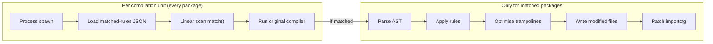

# How-To: Continuous Compile-Time Benchmarking

This document explains the compile-time benchmarking strategy for the project: what is measured, how the scenarios are structured, and how to run benchmarks locally.

## Table of Contents

- [Why compile-time overhead?](#why-compile-time-overhead)
- [Overhead model](#overhead-model)
- [Benchmark scenarios](#benchmark-scenarios)
- [Running benchmarks locally](#running-benchmarks-locally)
- [Measurement methodology](#measurement-methodology)
- [Output format](#output-format)
- [Complementary profiling](#complementary-profiling)

## Why compile-time overhead?

`otelc` instruments Go applications at compile time using `go build -toolexec`. Every package compiled during a build spawns a new `otelc toolexec` process. Even for packages where no instrumentation rules match, the tool still pays a fixed cost:

1. Process spawn.
2. Load the matched-rules JSON file from disk.
3. Linearly scan all rule sets to confirm no match.
4. Execute the original compiler unchanged.

For small projects with only a handful of packages this is negligible. For larger projects the per-unit cost accumulates, making compile-time overhead the primary UX metric to track.

## Overhead model

There are two distinct layers of overhead. The benchmark scenarios are designed to isolate each layer.



## Benchmark scenarios

Scenarios live in `test/bench/scenarios/`:

| Scenario | Dependencies | Instrumented pkgs | What it measures |
| :--- | :--- | :---: | :--- |
| `baseline` | stdlib only (`fmt`) | 0 | Pure scaffolding: setup phase + toolexec passthrough for a small stdlib dep tree, no rule matches. |
| `multi` | `net/http` + gRPC + `database/sql` + Redis | 6–8 | Worst case: all available instrumentation rules active and exercised simultaneously. |
| `largeidle` | Heavy stdlib + many third-party libs, no matching targets | **0** | "Tax" on large projects: many compilation units all passing through toolexec with zero AST rewriting. |

The `largeidle` scenario is the most important for realistic enterprise codebases where a user enables `net/http` instrumentation but has hundreds of internal or third-party packages that do not match any rule.

## Running benchmarks locally

Prerequisites: `otelc` must be built first.

```bash
# Build otelc, then build the harness and print usage.
make benchmark

# Run all scenarios (5 timed iterations each, after warmup) and write bench.json.
make benchmark/run

# Use more iterations for a more stable measurement.
make benchmark/run BENCH_ITERATIONS=10
```

The harness binary accepts additional flags for advanced use:

```bash
.bin/bench \
  -otelc=./otelc \
  -scenarios=test/bench/scenarios \
  -iterations=5 \
  -warmup=1 \
  -output=bench.json
```

## Measurement methodology

The harness reduces run-to-run noise with the following defaults:

1. **Warmup** (`-warmup`, default `1`): Before any timed build, each scenario runs one discarded plain `go build -a` and one discarded `otelc go build -a` so filesystem and toolchain caches are warm.
2. **Interleaved builds**: Timed iterations alternate plain then `otelc` for the same iteration index, so both tools see similar system load within each cycle (instead of timing all plain builds first, then all `otelc` builds).
3. **Mean as the primary value**: The reported seconds and overhead percentage use the arithmetic mean of the timed iterations.
4. **Trimmed spread in `range`**: When there are at least five timed iterations, the reported spread is the population standard deviation after dropping the single fastest and slowest sample. With fewer than five iterations the full-sample standard deviation is used.
5. **`GOGC=off`**: Child processes run with `GOGC=off` to reduce garbage-collection jitter inside the Go toolchain during the measured builds.

For investigating a specific change, prefer `BENCH_ITERATIONS=10` (or higher) locally.

## Output format

The harness emits a JSON array with one entry per scenario comparing the plain `go build` and `otelc` compile times:

```json
[
  {
    "scenario": "baseline",
    "iterations": 5,
    "warmup": 1,
    "plain_mean_s": 1.230,
    "plain_range_s": 0.050,
    "otelc_mean_s": 1.450,
    "otelc_range_s": 0.080,
    "overhead_pct": 17.9
  }
]
```

The harness accepts a `-max-overhead-pct` flag for local threshold checks. When set, it writes `bench.json` and then exits non-zero if any scenario's overhead exceeds the threshold:

```bash
make benchmark/run BENCH_ITERATIONS=10 BENCH_MAX_OVERHEAD_PCT=150
```

CI runs with `BENCH_MAX_OVERHEAD_PCT=150`, failing the job when `otelc` compile time is more than 150% above the plain `go build` baseline measured in the same run.

## Complementary profiling

`otelc` ships built-in pprof support that provides deeper insight into where compile-time cost is spent. Use it alongside the benchmarks when investigating a regression:

```bash
# Collect a CPU profile for the largeidle scenario.
otelc --profile-path="$PWD/profiles" --profile=cpu --profile-summary \
  go build -a ./test/bench/scenarios/largeidle/...

# Open the merged profile.
go tool pprof -http=:8080 profiles/otelc-cpu.pprof
```

See [profiling.md](profiling.md) for the full reference.
